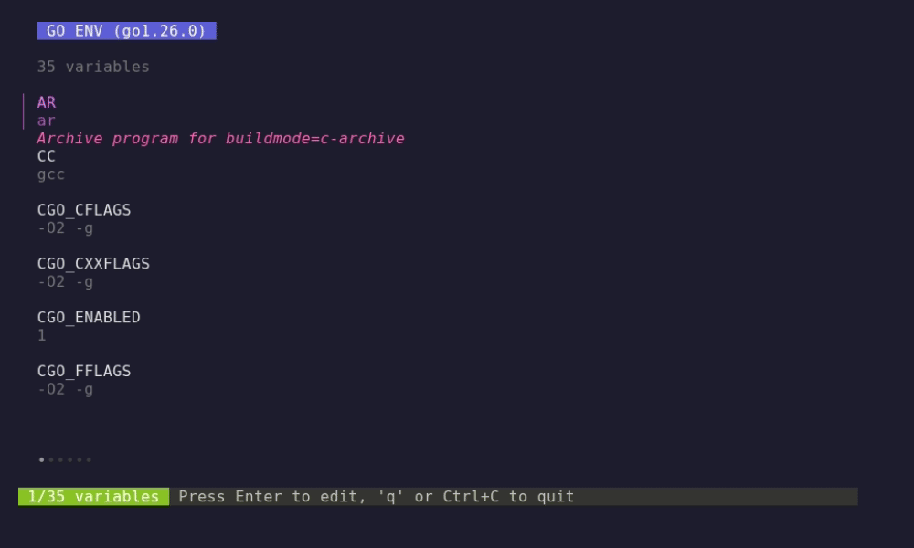
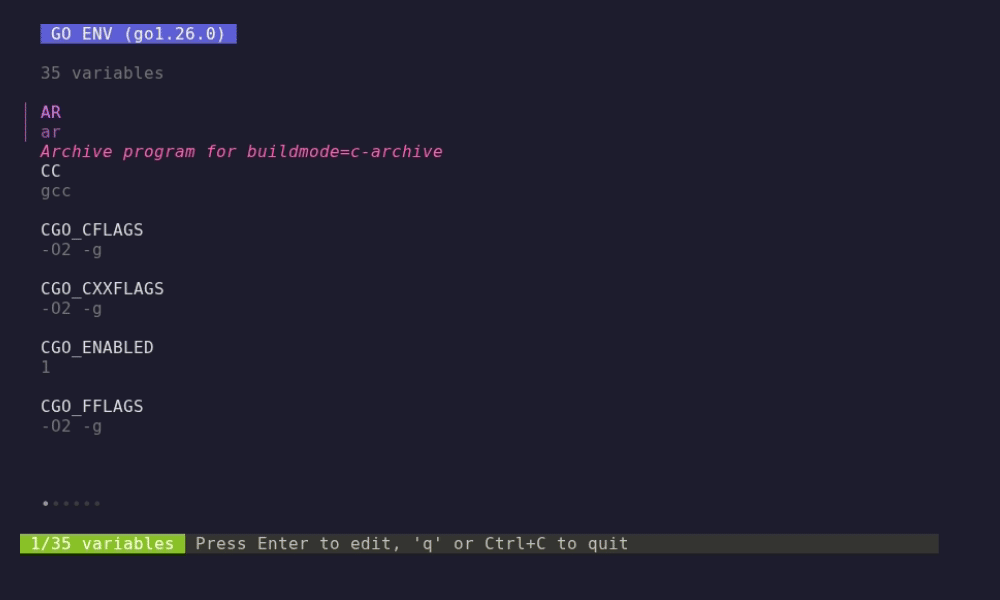
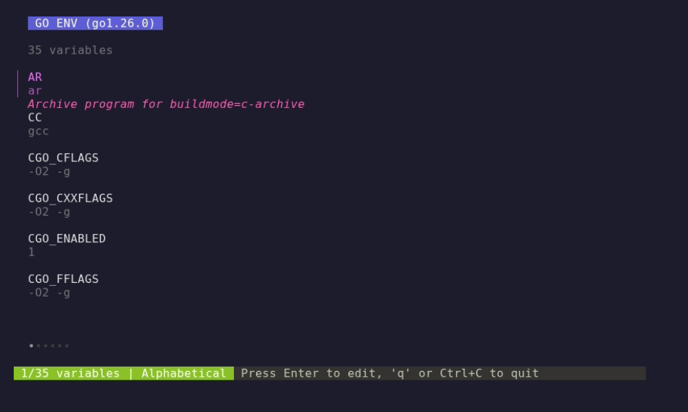
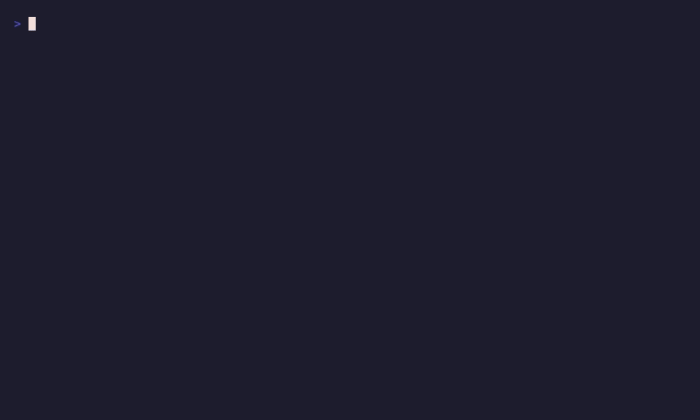

# goenv

[](https://goreportcard.com/report/github.com/alexrios/goenv)
[](https://www.gnu.org/licenses/gpl-3.0)

A terminal UI (TUI) application for viewing and editing Go environment variables (`go env`).


## Features

- Browse all Go environment variables in a scrollable list
- Edit variables with inline validation and autocomplete suggestions
- Version-aware validation (filters suggestions by detected Go version)
- Visual diff showing old vs new values while editing
- Undo/redo support with persistent history across sessions
- Pin favorite variables to the top of the list
- Multiple sort modes: alphabetical, modified-first, by category
- Category filtering to show variables from a single category
- Search across key, value, and description
- Export/import environment snapshots as JSON files
- Create and manage reusable presets for different workflows
- Five built-in presets for common workflows (Static Linux Build, WASM Target, etc.)
- Compare current environment with saved snapshots or presets
- View statistics about your environment configuration
- Command palette (`:`) for fuzzy command search
- Watch mode with auto-reload and change highlighting
- Three built-in color themes: default, nord, dracula
- Copy values to clipboard via OSC52 (works over SSH)
- CLI mode for scripting and automation
- Quit confirmation when session has unsaved edits

### Edit with Validation & Suggestions



### Undo / Redo


### Search & Filter


### Snapshots


### Presets


### Compare



### Statistics


### Shell Export


### Command Palette


### Category Filter



### Watch Mode


### Themes


### CLI Mode



## Installation

### Homebrew (macOS / Linux)

```bash
brew install alexrios/tap/goenv
```

### Download binary

Pre-built binaries for Linux, macOS, and Windows (amd64/arm64) are available on the [Releases](https://github.com/alexrios/goenv/releases) page.

### Using go install

```bash
go install github.com/alexrios/goenv/cmd/goenv@latest
```

### From source

```bash
git clone https://github.com/alexrios/goenv.git
cd goenv
mise run build
bin/goenv
```

## Usage

```bash
# Run the application
goenv

# Run with debug logging (writes to messages.log)
mise run debug

# In another terminal, watch the logs
mise run logs
```

### CLI Mode

goenv can be used non-interactively for scripting and automation:

```bash
goenv --version                          # Show version and Go version
goenv --list                             # List all variables (pipe-friendly)
goenv --get GOPATH                       # Get a single variable value
goenv --set CGO_ENABLED=0 GOOS=linux     # Set one or more variables
goenv --export fish                      # Export as fish shell commands
goenv --export bash --modified           # Export only modified variables as bash
goenv --help                             # Show help
```

Short flags: `-v` (version), `-l` (list), `-h` (help).

Variables marked with `*` in `--list` output are user-modified (via `go env -w`). Export formats: `bash` (default), `fish`, `powershell`, `json`.

```bash
# Use in scripts
GOPATH=$(goenv --get GOPATH)

# Pipe to grep
goenv --list | grep PRIV

# Export modified vars to a file
goenv --export bash --modified > env.sh
```

## Keyboard Shortcuts

### Navigation

| Key | Action |
|-----|--------|
| `j` / `k` | Move down/up |
| `Ctrl+D` | Half-page down |
| `Ctrl+U` | Half-page up |
| `g` / `G` | Go to top/bottom |
| `/` | Search/filter variables |
| `Enter` | Edit selected variable |
| `q` | Quit |

### Actions

| Key | Action |
|-----|--------|
| `y` | Copy value to clipboard |
| `Y` | Copy KEY=VALUE to clipboard |
| `f` | Toggle favorite (pin to top) |
| `s` | Toggle sort mode |
| `C` | Cycle category filter |
| `r` | Reload environment |
| `t` | Cycle color theme |
| `w` | Toggle watch mode (auto-reload) |
| `:` | Open command palette |
| `Ctrl+Z` | Undo last change |
| `Ctrl+Y` | Redo last change |
| `?` | Show help screen |

### Snapshots & Presets

| Key | Action |
|-----|--------|
| `e` | Export snapshot |
| `i` | Import snapshot |
| `p` | Manage presets |
| `c` | Compare with snapshot/preset |
| `S` | Show statistics |

### Reset & Export

| Key | Action |
|-----|--------|
| `u` | Reset variable to default |
| `U` | Batch reset to defaults |
| `x` | Export as shell commands |

### Edit Mode

| Key | Action |
|-----|--------|
| `Enter` | Save changes |
| `Esc` | Cancel editing |
| `Ctrl+R` | Reset to original value |
| `Tab` / `Shift+Tab` | Next/previous suggestion |

## Configuration

goenv stores its configuration in `~/.config/goenv/config.json`:

```json
{
  "sortMode": "alpha",
  "theme": "default",
  "favorites": ["GOPATH", "GOROOT"],
  "watchInterval": 5,
  "maxHistory": 50
}
```

### Configuration Options

| Option | Values | Description |
|--------|--------|-------------|
| `sortMode` | `alpha`, `modified_first`, `category` | How to sort variables in the list |
| `theme` | `default`, `nord`, `dracula` | Color theme |
| `favorites` | array of strings | Variable names pinned to top |
| `watchInterval` | integer (seconds) | Watch mode reload interval (default: 5, range: 1-86400) |
| `maxHistory` | integer | Maximum undo/redo history entries (default: 50) |

## Snapshots & Presets

### Snapshots

Snapshots capture your current environment state to a JSON file. Use them to:
- Back up your configuration before making changes
- Share environment settings between machines
- Track changes over time

Export with `e`, import with `i`.

### Presets

Presets are named configurations stored in `~/.config/goenv/presets/`. Use them for:
- Switching between development contexts (e.g., CGO on/off)
- Quickly applying common configurations
- Sharing standard setups with your team

goenv ships with five built-in presets: Static Linux Build, WASM Target, Cross-compile ARM64, Debug Verbose, and Minimal Proxy. Built-in presets cannot be deleted.

Manage presets with `p`.

## Themes

goenv includes three color themes:

### Default
The built-in theme with purple/pink accents, suitable for most terminals.

### Nord
Inspired by the [Nord](https://www.nordtheme.com/) color palette. Cool, blue-tinted colors.

### Dracula
Inspired by the [Dracula](https://draculatheme.com/) theme. Rich purples and pinks on a dark background.

To change themes, press `t` to cycle through them or edit `~/.config/goenv/config.json`:

```json
{
  "theme": "nord"
}
```

## Environment Variables

goenv organizes variables into categories:

- **General**: GOROOT, GOPATH, GOBIN, GOCACHE, etc.
- **Modules**: GO111MODULE, GOMODCACHE, GOPRIVATE, etc.
- **Proxy/Network**: GOPROXY, GOSUMDB, GOVCS
- **Build**: GOEXE, GOEXPERIMENT, GOTOOLCHAIN
- **CGO**: CGO_ENABLED, CGO_CFLAGS, CC, CXX, etc.
- **Architecture**: GOOS, GOARCH, GOAMD64, GOARM, etc.
- **Tooling**: GOTOOLDIR, GOCOVERDIR
- **Debug/Telemetry**: GODEBUG, GOTELEMETRY

## Data Storage

| File | Purpose |
|------|---------|
| `~/.config/goenv/config.json` | User preferences |
| `~/.config/goenv/history.json` | Undo/redo history |
| `~/.config/goenv/presets/*.json` | Saved presets |

Snapshots are saved to the directory you specify during export.

## Dependencies

Built with:
- [Bubble Tea](https://charm.land/bubbletea) - TUI framework
- [Bubbles](https://charm.land/bubbles) - TUI components
- [Lip Gloss](https://charm.land/lipgloss) - Styling

## License

GPL v3 License - see [LICENSE](LICENSE) for details.
